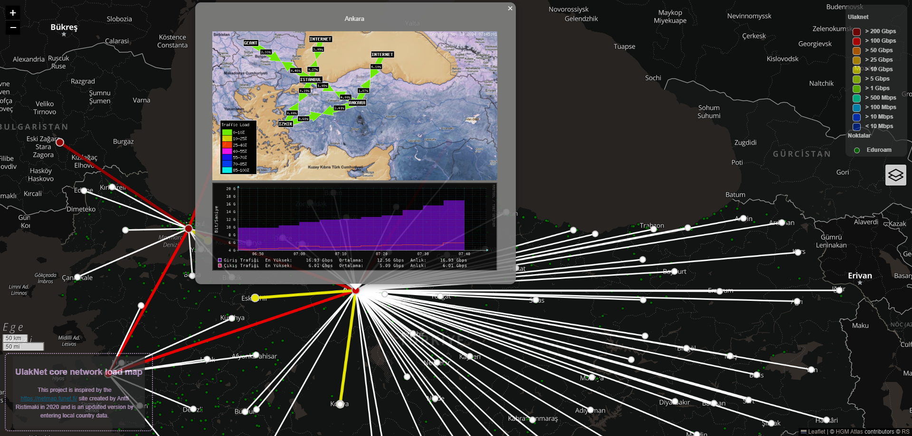

# UlakNet Core Network Load Map

This project is inspired by the [https://netmap.funet.fi/](https://netmap.funet.fi/) site created by Antti Ristimaki (@aristima) in 2020 and is an updated version by entering local country data.

## Data Sources

- [ULAKBİM](https://www.ulakbim.gov.tr/) - Turkey
  - [ULAKNET Bağlantı İstatistikleri](https://stat.ulakbim.gov.tr/ulaknet/)
  - [ULAKNET Üniversite Ağları](https://veri.ulakbim.gov.tr/hizmet/9)
  - [ULAKNET Dağıtım Bağlantı Noktaları (Ana Omurga-Şehir)](https://ulakbim.tubitak.gov.tr/tr/hizmetlerimiz/ag-teknolojileri-birimi-atb)

- [EDUROAM](https://www.eduroam.org/)
  - [EDUROAM Türkiye](http://www.eduroam.org.tr/)

## Dependencies

- [OpenStreetMap](https://www.openstreetmap.org/)
- [Leaflet](https://leafletjs.com/)
- [Leaflet.PolylineMeasure](https://github.com/bbecquet/Leaflet.PolylineOffset) (It is being held for future use.)

## Map Data

- [OpenStreetMap Tile List](https://wiki.openstreetmap.org/wiki/Raster_tile_providers)
- [HGM Atlas](https://atlas.gov.tr/)
- [Free Map Tiles](https://gist.github.com/Yago/05d479de169a21ba9fff)
- [JOSM Maps](https://josm.openstreetmap.de/maps) (XML)

## License

This project is licensed under the MIT License - see the [LICENSE](LICENSE) file for details.

## Authors

- [Ramazan Sancar](@ramazansancar)
- [Antti Ristimaki](@aristima)
